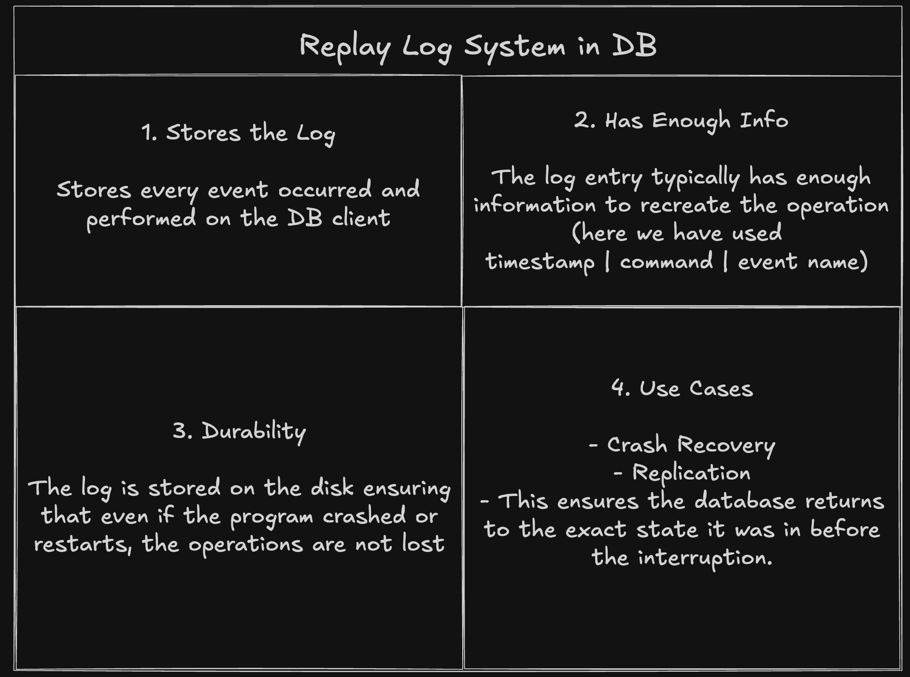

# Database with Replay Logs


``` bash
> set name Alice
OK
> set age 25
OK
> delete name
OK
> list
age: 25
> log
Log entries:
  <timestamp> SET name Alice
  <timestamp> SET age 25
  <timestamp> DELETE name
> exit
```
